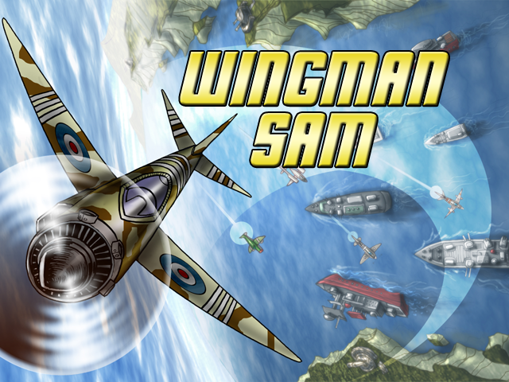
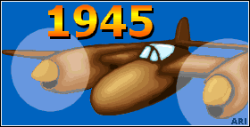
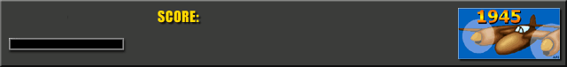
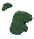
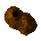
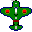

# Project 1945 by Tronus

Project 1945 is a top down scroller game made with SDL2, CMake and programmed in C as a project of study for the Italian Videogames Academy for the 3rd year course of Videogames programming.
The game is based on the old videogame [1945: The Final Front](https://www.youtube.com/watch?v=uBIbxobSUcY) of the 2002.

## User Guide

In the Release tab on the right part of the screen you, will find the Final Game download link if you want to play it immediatly.

## Developer Guidelines

Install clang as compiler.
Install CMake and use the compiling kit inside Visual Studio Code named amd64 to make builds.
Inside Visual Studio Code make a Delete Cache and Reconfigure to refresh the project paths.

## Game Description
In Project 1945 you will be able to Embark yourself in a 640x480 resolution adventure and save in the Main Menu your Best Scores and all your Boss Kills.
In the window of the game you will see the Icon and the name of the game and also the amount of time elapsed from the start of the application and the current FPS.
In the Main Menu pressing the "E" will let you start the game, pressing the "Q" will let you quit the application.

Inside the game, in the top left side of the screen, you will see the number of waves of the other planes you need to wait to let appear the Final Boss from above. The Big Plane will come only when that counter will reach the 0.

On the bottom of the screen you will see an Info Panel about the statistics of the current game:
- a Lifes Counter in the bottom left corner:  
1) It can reach a maximum of 4 lifes;  
2) The lifes can be obtained collecting perks during a game;  
3) The lifes can be lost when your Energy Bar reachs the 0;
4) When you lose a life you will be unable to move your Plane for some seconds and it will blink for the same amount of time;
5) When you will lose all your lifes, your plane will EXPLODE and the game will be restarted after some seconds!

- an Energy Bar, below the Lifes Counter:  
1) Every time it is empty, you will lose 1 life. Then if you have more than 0 Lifes, it will be refilled again;  
2) Losing Energy can occur hitting other planes or bullets;

- a Score Counter, in the bottom middle part of the screen:  
1) You will receive Score Points every time you destroy another plane or bullet or get a perk;

Your plane is positioned in the bottom middle part of the screen, at the border with the below Info Panel. You will not be able to move into the Info Panel.
Losing all your Lifes or defeating the Final Boss will let the game restart, if you want to quit and return to the Main Menu just press the "Esc" button.
During the game some bullets, planes, perks and islands will be spawned in the top part of the screen and will move to the bottom part of the screen.
The other planes and the Final Boss will not follow always a straight direction and sometimes they will move horizzontally to the rigth or to the left direction.
The other planes sometimes will shoot some bullets ahead of them. You can also shoot your bullets.

  

When you lost a life and your plane is blinking you cannot be damaged or obtain any sort of Perk.
Your plane will be able to shoot a bullet only after some time by pressing the correct button.

## Perks

Every time you obtain a Perk you will be rewarded with some Score Points. When you lost a life and your plane is blinking you cannot obtain any kind of Perk.

There are 2 kind of Perks that can be spawned and obtrained:
- Life Perk: 
1) Will get you 1 Life;

- Special Bullets Perk:
1) Will grant you a bigger amount of bullets to be shooted for a short period of time (so press fastly your Space Bar);

## Controls

### Player
-Player movements: Arrow Keys
-Shoot: Space bar

### Game Scene

-Return to Main Menu: Esc

### Main Menu
-Start a game: E
-Quit the game: Q

## Copyright
Attribution-NonCommercial-ShareAlike 4.0 International (CC BY-NC-SA 4.0) 
